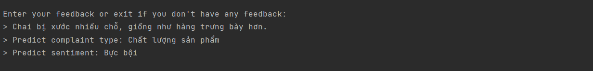
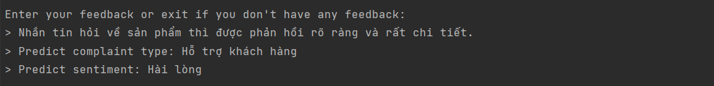
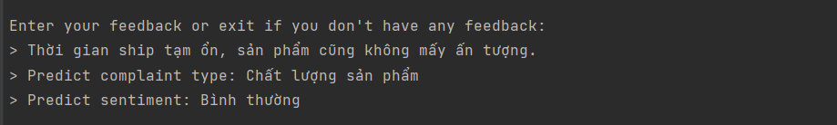
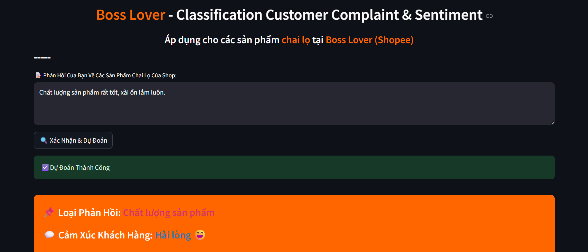
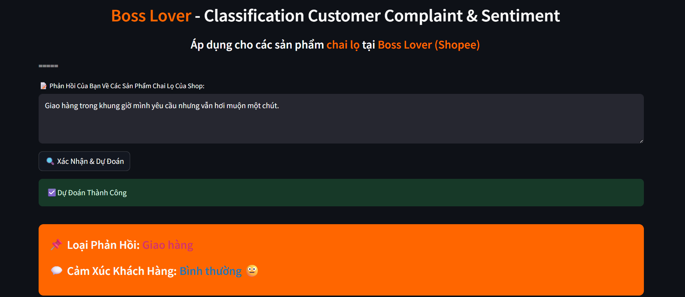
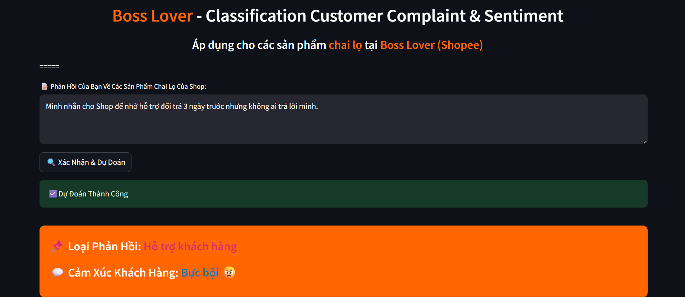

# Hệ Thống Nhận Diện Và Dự Đoán Phản Hồi Khi Mua Hàng Trên Shopee Của Khách Hàng

## I. Mô Tả Dữ Liệu
### Dữ liệu thu thập được sẽ gồm 3 thành phần chính: text (Phản hồi của khách hàng), complaint_type (Loại phản hồi), sentiment (Cảm xúc của loại phản hồi). Toàn bộ dữ liệu trong dự án này đều được thu thập hoặc đã được biến tấu lại trên phần "Bình luận" trong các sản phẩm của Shop "BossLover" mà tôi đang làm việc tại đó.

## II. Kết Quả Đạt Được
###1.

###2.

###3.

###4.

###5.

###6.

###7.

## III. Công Nghệ Sử Dụng Trong Dự Án
### 1. Ngôn ngữ chính: Python
### 2. Xử lý dữ liệu: PhoBERT Tokenizer, Pandas, Underthesea
### 3. Huấn luyện mô hình: BertForSequenceClassification
### 4. Giao diện: Streamlit

## IV. Cách Cài Đặt
### 1. Clone repo về máy "git clone https://github.com/akaichi21/Customer_Complaint_Sentiment_Detection", "cd Customer_Complaint_Sentiment_Detection"
### 2. Tạo thư mục "models" chứa "complaint_model", "sentiment_model", "tokenizer"
### 3. Huấn luyện mô hình "python train_model.py"
### 4. Kiểm thử mô hình "python test_model.py"
### 5. Chạy ứng dụng Streamlit "streamlit run app.py"